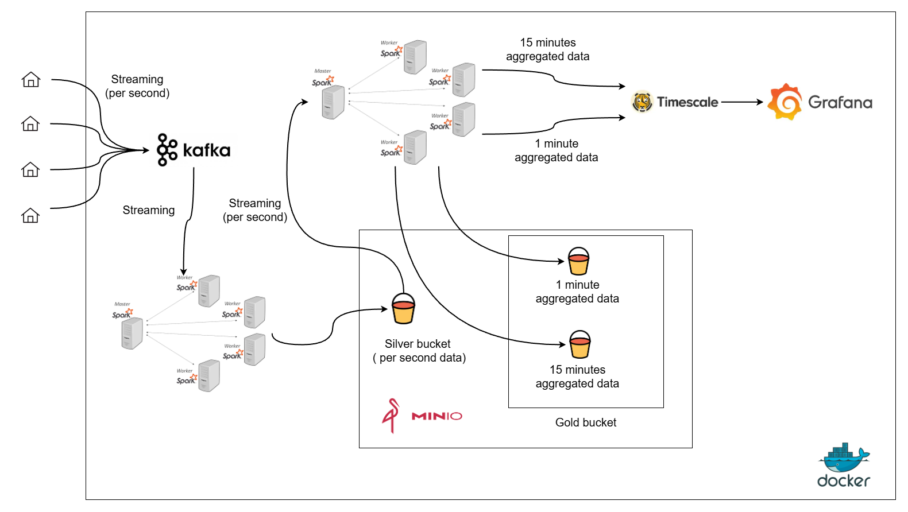
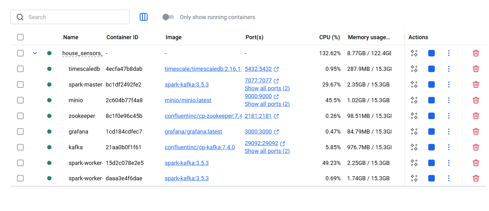
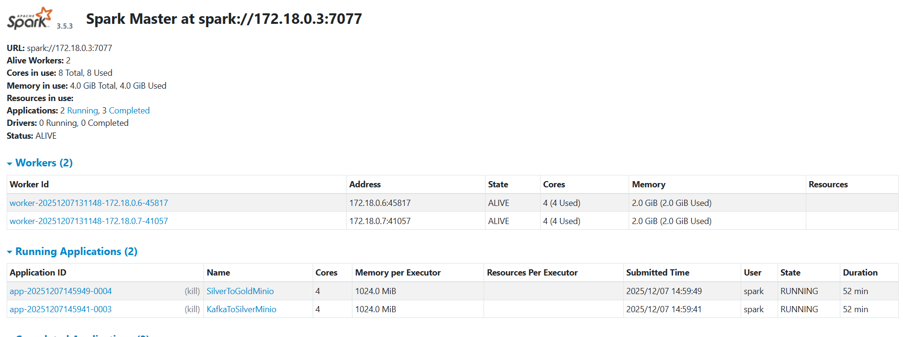
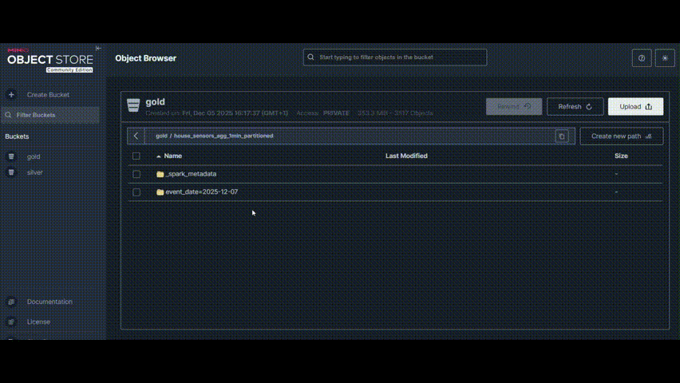

<p align="center">
  
</p>

# Real-time Streaming Pipeline: Kafka → Spark → MinIO → TimescaleDB → Grafana

End-to-end, containerised streaming pipeline for **house sensors data**:

- **Python producer** generates synthetic measurements for ~10,000 houses.
- **Kafka** ingests JSON events into a topic.
- **Spark Structured Streaming – Job 1** reads Kafka and writes a **Silver** layer to **MinIO** as Parquet, partitioned by **date and hour**.
- **Spark Structured Streaming – Job 2** reads from Silver, computes **1‑minute** and **15‑minute** aggregates, and writes:
  - **Gold** Parquet data back to MinIO, and
  - aggregated time-series into **TimescaleDB** (PostgreSQL).
- **Grafana** connects to TimescaleDB and shows prebuilt dashboards.




This README is designed as a **comprehensive, step‑by‑step guide for new users**, based entirely on the code and Markdown files in this repository.

---

## Table of Contents

1. [High-level Overview](#1-high-level-overview)  
2. [Architecture & Data Flow](#2-architecture--data-flow)  
3. [Data Model](#3-data-model)  
4. [Repository Layout](#4-repository-layout)  
5. [Prerequisites](#5-prerequisites)  
6. [One-Time Environment Setup](#6-one-time-environment-setup)  
7. [Starting the Core Services](#7-starting-the-core-services)  
8. [Configuring MinIO Buckets](#8-configuring-minio-buckets)  
9. [Creating the Kafka Topic](#9-creating-the-kafka-topic)  
10. [TimescaleDB: Tables & Timezone](#10-timescaledb-tables--timezone)  
11. [Python Producer – Generating Synthetic Data](#11-python-producer--generating-synthetic-data) 
12. [Spark Streaming Job 1 – Kafka → Silver (MinIO)](#12-spark-streaming-job-1--kafka--silver-minio)  
13. [Spark Streaming Job 2 – Silver → Gold (MinIO & TimescaleDB)](#13-spark-streaming-job-2--silver--gold-minio--timescaledb)  
14. [Grafana Dashboards](#14-grafana-dashboards)  
15. [Resetting the Pipeline](#15-resetting-the-pipeline)  
16. [End-to-End Quick Checklist](#16-end-to-end-quick-checklist)  

---

## 1. High-level Overview

This project simulates and processes **house electricity sensor data** in real time.

Each event looks like:

```json
{
  "house_id": "2113",
  "timestamp": "2025-12-06T08:26:19.230240+00:00",
  "pv_panel_kw": 29.78,
  "ev_charging_kw": 65.09,
  "power_kw": 0.142,
  "voltage": 219.9
}
```

- **house_id** – Integer-like string ID, `"0"` … `"9999"`.
- **timestamp** – ISO‑8601 string with timezone (UTC in the producer).
- **pv_panel_kw** – Solar PV production at that instant (kW).
- **ev_charging_kw** – EV charging power (kW).
- **power_kw** – Net power at the grid connection (kW).
- **voltage** – Line voltage for that house (V).

The pipeline:

1. Producer writes events to Kafka topic `sensor_raw`.
2. Spark Job 1 consumes `sensor_raw` and writes a **Silver** Parquet layer to MinIO:
   - Partitioned by **date** and **hour**, suitable for Trino/Presto and other engines.
3. Spark Job 2 reads Silver, computes **1‑minute** and **15‑minute** aggregates:
   - Writes **Gold** Parquet files to MinIO.
   - Writes aggregated time‑series rows into **TimescaleDB**.
4. Grafana connects to TimescaleDB and displays live dashboards.

---

## 2. Architecture & Data Flow

### 2.1 Components

All components run in Docker containers defined in `docker-compose.yml`:

- **zookeeper** – Zookeeper for Kafka.
- **kafka** – Kafka broker.
- **spark-master** – Spark master node.
- **spark-worker-1**, **spark-worker-2** – Spark workers (share config via `x-spark-common`).
- **minio** – S3‑compatible object storage.
- **timescaledb** – TimescaleDB (PostgreSQL) database.
- **grafana** – Grafana UI, with provisioning for TimescaleDB datasource and dashboards.

There is also a **Python producer** you run on your host machine.


---

## 3. Data Model

### 3.1 Raw events (Producer → Kafka)

- `house_id: string`  
  Random ID from 0 to `NUM_HOUSES-1` (default: 10,000 houses).
- `timestamp: string`  
  `datetime.now(timezone.utc).isoformat()`; precise event time in UTC.
- `pv_panel_kw: float`  
  Modeled as a daytime‑only generation curve with randomness.
- `ev_charging_kw: float`  
  Non‑zero mainly in evenings and nights; random session start/end.
- `power_kw: float`  
  Net grid power:
  ```text
  power_kw ≈ base_house_load_kw + ev_charging_kw - pv_panel_kw
  ```
- `voltage: float`  
  Around typical 230V with small random deviation per event.

### 3.2 Silver schema (MinIO Parquet)

Spark Job 1 (`jobs/kafka_to_silver_minio.py`) parses JSON and adds partition columns.

Columns in Silver:

- `house_id: string`
- `timestamp: string`
- `pv_panel_kw: double`
- `ev_charging_kw: double`
- `power_kw: double`
- `voltage: double`
- `event_time: timestamp` (parsed from `timestamp`)
- `dt: date` (derived from `event_time`, used as partition)
- `hour: int` (0–23, hour of day, used as partition)

Files are written to:

```text
s3a://silver/house_sensors_raw/dt=YYYY-MM-DD/hour=HH/part-*.snappy.parquet
```

### 3.3 Gold schema (MinIO + TimescaleDB)

Spark Job 2 (`jobs/silver_to_gold_minio_timescale.py`) is designed to:

- Read Silver Parquet from MinIO.
- Group by **house_id** and **time window**.
- Compute aggregates for **1‑minute** and **15‑minute** windows.

The TimescaleDB tables are:

```sql
CREATE TABLE house_sensors_agg_1min (
    house_id TEXT,
    window_start TIMESTAMPTZ NOT NULL,
    window_end   TIMESTAMPTZ NOT NULL,
    avg_power_kw DOUBLE PRECISION,
    max_power_kw DOUBLE PRECISION,
    avg_pv_panel_kw DOUBLE PRECISION,
    avg_ev_charging_kw DOUBLE PRECISION
);

CREATE TABLE house_sensors_agg_15min (
    house_id TEXT,
    window_start TIMESTAMPTZ NOT NULL,
    window_end   TIMESTAMPTZ NOT NULL,
    avg_power_kw DOUBLE PRECISION,
    max_power_kw DOUBLE PRECISION,
    avg_pv_panel_kw DOUBLE PRECISION,
    avg_ev_charging_kw DOUBLE PRECISION
);
```

In MinIO Gold Parquet these aggregates are typically stored with extra partition columns:

- `event_date: date` (derived from window start)
- `hour: int` (derived from window start hour)

Paths (as used in the Timescale setup and job code):

- `s3a://gold/house_sensors_agg_1min_partitioned`
- `s3a://gold/house_sensors_agg_15min_partitioned`

---

## 4. Repository Layout


```text
Real_time_Data_Streaming_Pipeline/
│
├── docker-compose.yml│
├── spark/
│   └── Dockerfile                     # Builds `spark-kafka:3.5.3` image
│
├── jobs/
│   ├── kafka_to_silver_minio.py       # Spark Job 1: Kafka → Silver MinIO (partitioned)
│   ├── silver_to_gold_minio_timescale.py  # Spark Job 2: Silver → Gold MinIO + TimescaleDB
│
├── producer/
│   ├── producer.py                    # Synthetic data generator → Kafka
│   └── requirements.txt               # Dependencies for producer
│
└── grafana/
    ├── dashboards/
    │   ├── house_sensors.json         # Dashboard for 1‑minute aggregates
    │   └── house_sensors_15min.json   # Dashboard for 15‑minute aggregates
    └── provisioning/
        ├── datasources/
        │   └── timescale.yml          # TimescaleDB datasource definition
        └── dashboards/
            └── dashboards.yml         # Provisioning for dashboards directory
```

---

## 5. Prerequisites

On the **host machine** (your laptop/PC):

- **Docker** and **Docker Compose** installed.
- **Python 3.10** installed.
- Basic command‑line familiarity.

Recommended resources:

- At least **4 CPU cores** and **8 GB RAM** for comfortable streaming and dashboard use.

You **do not** need to install Kafka, Spark, MinIO, TimescaleDB, or Grafana locally – they all run inside Docker containers defined in `docker-compose.yml`.

---

## 6. One-time Environment Setup

All commands below are run from the **project root**:

```bash
cd Real_time_Data_Streaming_Pipeline
```

### 6.1 Clone the repository (if not already)

```bash
git clone https://github.com/rbahmani01/Real_time_Data_Streaming_Pipeline.git
cd Real_time_Data_Streaming_Pipeline
```

> If you cloned under a different folder name, adjust paths accordingly.

### 6.2 Create local data directories

These directories are mounted into containers to persist data on your host:

```bash
mkdir -p minio-data
mkdir -p timescale-data
mkdir -p grafana/dashboards
mkdir -p grafana/provisioning
```

- `minio-data` – MinIO bucket storage backend.
- `timescale-data` – TimescaleDB data directory.
- `grafana/provisioning` – Grafana provisioning config (datasources, dashboards).
- `grafana/dashboards` – Grafana dashboard JSON files.

The repository already includes the appropriate provisioning files in `grafana/provisioning` and dashboard JSONs in `grafana/dashboards`.

### 6.3 Build the custom Spark image

The Spark workers and master use an image called `spark-kafka:3.5.3` built from `spark/Dockerfile`.

Build it once:

```bash
docker build -t spark-kafka:3.5.3 ./spark
```

This image includes:

- Spark 3.5.3.
- Kafka connector jars.
- Hadoop‑AWS and AWS SDK (for S3/MinIO).
- PostgreSQL JDBC driver (for TimescaleDB).

---

## 7. Starting the Core Services

Start all containers in the background:

```bash
docker compose up -d
```

This starts:

- `zookeeper`
- `kafka`
- `spark-master`
- `spark-worker-1`
- `spark-worker-2`
- `minio`
- `timescaledb`
- `grafana`

Verify everything is up:

```bash
docker ps
```

You should see all the above containers listed.



### 7.1 Important service endpoints

From `docker-compose.yml` and the Timescale/Grafana docs:

- **Kafka (inside Docker)**: `kafka:9092`
- **Kafka (from host)**: `localhost:29092`  
  (via `KAFKA_ADVERTISED_LISTENERS`)

- **Zookeeper**: `zookeeper:2181` (inside Docker), mapped to `localhost:2181`.

- **MinIO API (S3)**: <http://localhost:9000>  
- **MinIO Console**: <http://localhost:9001>  
  - Access key: `minioadmin`
  - Secret key: `minioadmin`  
  (from environment: `MINIO_ROOT_USER` / `MINIO_ROOT_PASSWORD`)

- **Spark Master UI**: <http://localhost:9090>  
  (Spark master URL: `spark://spark-master:7077` inside Docker)

- **TimescaleDB (PostgreSQL)**:  
  - Host: `localhost`
  - Port: `5432`
  - Database: `sensordb`
  - User: `sensor`
  - Password: `sensor`

- **Grafana UI**: <http://localhost:3000>

---

## 8. Configuring MinIO Buckets

You need two buckets:

- `silver` – for raw, cleaned streaming data (Silver layer)
- `gold` – for aggregated outputs (Gold layer)

### 8.1 Enter MinIO container

```bash
docker exec -it minio sh
```

### 8.2 Configure the `mc` alias

Inside the container:

```bash
mc alias set minio http://minio:9000 minioadmin minioadmin
```

This defines the alias `minio` pointing to the MinIO server.

### 8.3 Create the buckets

Still inside the MinIO container:

```bash
mc mb minio/silver
mc mb minio/gold
```

The Spark jobs expect these exact bucket names and will write to:

- `s3a://silver/...`
- `s3a://gold/...`

Exit the container when done:

```bash
exit
```

---

## 9. Creating the Kafka Topic

The producer and Spark Job 1 communicate via Kafka topic `sensor_raw`.

### 9.1 Create `sensor_raw` inside the Kafka container

```bash
docker exec -it kafka \
  kafka-topics --create \
  --topic sensor_raw \
  --bootstrap-server kafka:9092 \
  --partitions 1 \
  --replication-factor 1
```

### 9.2 Verify the topic

```bash
docker exec -it kafka \
  kafka-topics --describe \
  --topic sensor_raw \
  --bootstrap-server kafka:9092
```

You should see configuration details printed for `sensor_raw`.

> **Reminder:**  
> - From **inside containers**, use `kafka:9092`.  
> - From your **host machine**, use `localhost:29092` (for the Python producer).

---

## 10. TimescaleDB: Tables & Timezone

### 10.1 Connect to TimescaleDB

Open a psql shell:

```bash
docker exec -it timescaledb psql -U sensor -d sensordb
```

### 10.2 Create aggregate tables

From `timescale_grafana_setup.md`:

```sql
CREATE TABLE house_sensors_agg_1min (
    house_id TEXT,
    window_start TIMESTAMPTZ NOT NULL,
    window_end   TIMESTAMPTZ NOT NULL,
    avg_power_kw DOUBLE PRECISION,
    max_power_kw DOUBLE PRECISION,
    avg_pv_panel_kw DOUBLE PRECISION,
    avg_ev_charging_kw DOUBLE PRECISION
);

SELECT create_hypertable('house_sensors_agg_1min', 'window_start');

CREATE TABLE house_sensors_agg_15min (
    house_id TEXT,
    window_start TIMESTAMPTZ NOT NULL,
    window_end   TIMESTAMPTZ NOT NULL,
    avg_power_kw DOUBLE PRECISION,
    max_power_kw DOUBLE PRECISION,
    avg_pv_panel_kw DOUBLE PRECISION,
    avg_ev_charging_kw DOUBLE PRECISION
);

SELECT create_hypertable('house_sensors_agg_15min', 'window_start');
```

Optionally set retention policies (automatic old data cleanup):

```sql
SELECT add_retention_policy('house_sensors_agg_1min',  INTERVAL '7 days');
SELECT add_retention_policy('house_sensors_agg_15min', INTERVAL '1 year');
```

### 10.3 Fix TimescaleDB timezone (recommended)


```sql
SHOW TIMEZONE;
-- likely 'UTC'

SET TIMEZONE = 'Europe/Berlin';

-- or persist at database level:
ALTER DATABASE sensordb SET TIMEZONE = 'Europe/Berlin';
```

Exit psql when done:

```sql
\q
```

## 11. Python Producer – Generating Synthetic Data

**File:** `producer/producer.py`  
**Requirements:** `producer/requirements.txt`

### 11.1 Environment & config

At the top of `producer.py`:

```python
NUM_HOUSES = 10_000
TOPIC = "sensor_raw"
BOOTSTRAP_SERVERS = os.getenv("KAFKA_BOOTSTRAP", "localhost:29092")
```

- **NUM_HOUSES** – number of unique `house_id`s to simulate.
- **TOPIC** – Kafka topic name (must match `sensor_raw` created earlier).
- **BOOTSTRAP_SERVERS** – Kafka bootstrap server from host view (`localhost:29092`), overridable via `KAFKA_BOOTSTRAP` environment variable.

### 11.2 Install Python dependencies

Create a virtualenv (optional but recommended):

```bash
python3.10 -m venv venv
source venv/bin/activate        # Linux/macOS
# or on Windows (PowerShell):
# .\venv\Scripts\Activate
```

Install dependencies:

```bash
pip install -r producer/requirements.txt
```

The key dependency is `kafka-python`.

### 11.3 What the producer does conceptually

From the comments and structure in `producer.py`:

- Creates a `KafkaProducer` with:
  - JSON serialization: Python dict → UTF‑8 JSON bytes.
  - Reasonable batch and linger settings for high throughput.
- Pre‑builds random parameters per house:
  - Different base consumption scale for each house.
  - Different EV charging behaviour pattern.
- In a loop:
  - For each house:
    - Compute a “base household load” curve (day/night pattern).
    - Decide if EV is charging.
    - Compute PV output based on time of day (only positive during daytime).
    - Combine to calculate `power_kw` (grid power).
    - Generate small random variations for realism.
    - Emit a JSON event with all fields described in [3.1](#31-raw-events-producer--kafka).
  - Send events to Kafka asynchronously.
  - Log periodic statistics about send rate and batching.

Approximate message rate:  
**10,000** houses × ~1 event per second → around **10k messages/sec**, depending on timing and configuration.

### 11.4 Running the producer

From the project root:

```bash
python producer/producer.py
```

This will:

- Start connecting to Kafka at `localhost:29092`.
- Send messages to topic `sensor_raw`.
- Print log output about batches and message throughput.

Keep this running alongside the Spark jobs.

---

## 12. Spark Streaming Job 1 – Kafka → Silver (MinIO)

**File:** `jobs/kafka_to_silver_minio.py`  
**Goal:** Consume events from Kafka and write them as partitioned Parquet files to MinIO (Silver layer).

### 12.1 What the job does 

- Creates a Spark session.
- Configures **s3a** connector to talk to MinIO:
  - `fs.s3a.endpoint = http://minio:9000`
  - `fs.s3a.access.key = minioadmin`
  - `fs.s3a.secret.key = minioadmin`
  - `fs.s3a.path.style.access = true`
  - `fs.s3a.impl = org.apache.hadoop.fs.s3a.S3AFileSystem`
- Reads from Kafka:

  - `kafka.bootstrap.servers = kafka:9092`
  - `subscribe = sensor_raw`
  - `startingOffsets = latest` (only new data)

- Parses the `value` column as JSON using a schema matching the producer fields.
- Adds:
  - `event_time = to_timestamp(timestamp)`
  - `dt = to_date(event_time)` (date)
  - `hour = hour(event_time)` (0–23)
- Writes streaming output as Parquet:

  - Output path: `s3a://silver/house_sensors_raw`
  - Checkpoint path: `s3a://silver/_checkpoints/kafka_to_silver`
  - Partition columns: `dt`, `hour`
  - Output mode: `append`

### 12.2 Running the job

Open a terminal and run (from project root):

```bash
docker exec -it spark-master \
  /opt/spark/bin/spark-submit \
  --master spark://spark-master:7077 \
  --conf spark.executor.cores=2 \
  --conf spark.cores.max=4 \
  /opt/spark/jobs/kafka_to_silver_minio.py
```

Notes:

- `/opt/spark/jobs` inside the container is mapped to `./jobs` on your host by `docker-compose.yml`.
- This is a long‑running streaming job; keep this terminal open.
- You can monitor execution via the Spark UI at <http://localhost:9090>.




### 12.3 What to expect in MinIO

After a bit of data has flowed through:

- Go to <http://localhost:9001>, log into MinIO.
- Browse bucket `silver` → `house_sensors_raw/`.
- You should see directories like:

  ```text
  dt=2025-12-06/hour=14/part-0000-...snappy.parquet
  dt=2025-12-06/hour=15/part-0001-...snappy.parquet
  ...
  ```

---


## 13. Spark Streaming Job 2 – Silver → Gold (MinIO & TimescaleDB)

**File:** `jobs/silver_to_gold_minio_timescale.py`  
**Goal:** Read from Silver Parquet, compute aggregates, write Gold Parquet to MinIO, and insert aggregates into TimescaleDB.


### 13.1 High-level behaviour


1. Create Spark session with:
   - `spark.sql.session.timeZone = Europe/Berlin`
   - Tuned shuffle partitions (e.g. `spark.sql.shuffle.partitions = 4`).

2. Configure MinIO (same as Job 1) with `fs.s3a.*` settings.

3. Define Silver schema including partition columns:

   - `house_id`, `timestamp`, `pv_panel_kw`, `ev_charging_kw`, `power_kw`, `voltage`, `dt`, `hour`.

4. Read Silver as a streaming file source:

   ```text
   format = "parquet"
   schema = (above)
   path   = "s3a://silver/house_sensors_raw"
   ```

5. Add `event_time = to_timestamp(timestamp)`.

6. For **1‑minute aggregates**:

   - Use `withWatermark("event_time", "2 minutes")`.
   - Group by `house_id` and window(`event_time`, `1 minute`).
   - Compute:
     - `avg(power_kw)` → `avg_power_kw`
     - `max(power_kw)` → `max_power_kw`
     - `avg(pv_panel_kw)` → `avg_pv_panel_kw`
     - `avg(ev_charging_kw)` → `avg_ev_charging_kw`
   - Derive:
     - `event_date = to_date(window.start)`
     - `hour = hour(window.start)`

   - Write to MinIO Gold (Parquet), partitioned by `event_date` and `hour`.

   - In parallel, use `foreachBatch` with a helper function to write each micro‑batch to TimescaleDB table `house_sensors_agg_1min` via JDBC (`org.postgresql.Driver`).

7. For **15‑minute aggregates**:

   - Very similar, but window size is `15 minutes`.
   - Write to:
     - MinIO Gold path for 15‑minute aggregates.
     - TimescaleDB table `house_sensors_agg_15min`.

8. The job waits for any stream termination (it is long‑running).




### 13.2 Paths and configuration

The job uses:

- **Silver input path:**

  ```text
  s3a://silver/house_sensors_raw
  ```

- **Gold output paths:**

  ```text
  s3a://gold/house_sensors_agg_1min_partitioned
  s3a://gold/house_sensors_agg_15min_partitioned
  ```

- **Checkpoint locations:**

  ```text
  s3a://gold/_checkpoints/house_sensors_agg_1min_partitioned
  s3a://gold/_checkpoints/house_sensors_agg_15min_partitioned
  ```

- **TimescaleDB JDBC:**

  ```text
  url      = jdbc:postgresql://timescaledb:5432/sensordb
  user     = sensor
  password = sensor
  driver   = org.postgresql.Driver
  ```

### 13.3 Running the job

In another terminal, run:

```bash
docker exec -it spark-master \
  /opt/spark/bin/spark-submit \
  --master spark://spark-master:7077 \
  --conf spark.executor.cores=2 \
  --conf spark.cores.max=4 \
  /opt/spark/jobs/silver_to_gold_minio_timescale.py
```

Again, this is a long‑running job. You must keep it running while data is streaming.

### 13.4 Verifying TimescaleDB output

After some time:

1. Connect to TimescaleDB:

   ```bash
   docker exec -it timescaledb psql -U sensor -d sensordb
   ```

2. Check a few rows:

   ```sql
   SELECT * FROM house_sensors_agg_1min  LIMIT 10;
   SELECT * FROM house_sensors_agg_15min LIMIT 10;
   ```

You should see time windows, averages, and max values.

---


## 14. Grafana Dashboards

Grafana is fully provisioned from this repo.

### 14.1 Provisioned datasource

File: `grafana/provisioning/datasources/timescale.yml`:

```yaml
apiVersion: 1

datasources:
  - name: TimescaleDB
    type: postgres
    access: proxy
    isDefault: true
    url: timescaledb:5432
    user: sensor
    secureJsonData:
      password: sensor
    jsonData:
      database: sensordb
      sslmode: disable
      timescaledb: true
```

This tells Grafana to connect to the TimescaleDB container using the same credentials you used to create the tables.

### 14.2 Dashboard provisioning

File: `grafana/provisioning/dashboards/dashboards.yml`:

```yaml
apiVersion: 1

providers:
  - name: 'default'
    type: file
    disableDeletion: false
    updateIntervalSeconds: 10
    options:
      path: /var/lib/grafana/dashboards
```

The Docker volume mapping in `docker-compose.yml`:

```yaml
- ./grafana/dashboards:/var/lib/grafana/dashboards
```

So Grafana will automatically load any JSON dashboards placed under `grafana/dashboards/` in this repo:

- `grafana/dashboards/house_sensors.json`
- `grafana/dashboards/house_sensors_15min.json`

### 14.3 Accessing Grafana

1. Ensure `grafana` container is running:

   ```bash
   docker ps | grep grafana
   ```

2. Open the UI:

   <http://localhost:3000>

3. Log in with the credentials configured for your Grafana (if you haven’t customised them, check the documentation or environment variables you use – this repository itself does not hard‑code Grafana admin credentials).

4. You should see dashboards named similar to:

   - `house_sensors`
   - `house_sensors_15min`

They:

- Use the **TimescaleDB** datasource.
- Query `house_sensors_agg_1min` and `house_sensors_agg_15min`.
- Provide filters such as `house_id`.
- Show time‑series of average/max `power_kw`, as well as PV and EV charging power over time.


---


## 15. Resetting the Pipeline

Sometimes you want to completely **start fresh**, deleting all existing data and checkpoints. 

> **Warning:** This reset procedure will delete data from MinIO, Kafka, and (optionally) TimescaleDB.

### 15.1 Stop producer and Spark streaming jobs

- Stop the Python producer:


- Stop Spark Job 1 and Job 2:
  - Interrupt the terminals where you ran the `spark-submit` commands (or close those shells).

Make sure no more data is being produced or processed.

### 15.2 Clean Silver & Gold buckets and checkpoints

Open a shell in the MinIO container:

```bash
docker exec -it minio sh
```

Delete contents of `silver` and `gold` (including checkpoints):

```bash
mc alias set minio http://minio:9000 minioadmin minioadmin

mc rm --recursive --force minio/silver
mc rm --recursive --force minio/gold
```

Recreate buckets:

```bash
mc mb minio/silver
mc mb minio/gold
```

Exit MinIO shell:

```bash
exit
```

### 15.3 Reset Kafka topic

Option A – Delete and recreate `sensor_raw`:

```bash
docker exec -it kafka \
  kafka-topics --delete \
  --topic sensor_raw \
  --bootstrap-server kafka:9092

docker exec -it kafka \
  kafka-topics --create \
  --topic sensor_raw \
  --bootstrap-server kafka:9092 \
  --partitions 1 \
  --replication-factor 1
```

List topics to verify:

```bash
docker exec -it kafka \
  kafka-topics --bootstrap-server kafka:9092 --list
```

### 15.4 (Optional) Drop Timescale tables

If you also want to clear aggregates:

```bash
docker exec -it timescaledb psql -U sensor -d sensordb
```

Then:

```sql
DROP TABLE IF EXISTS house_sensors_agg_1min;
DROP TABLE IF EXISTS house_sensors_agg_15min;
```

Recreate them as described in [10.2](#102-create-aggregate-tables), and re‑apply retention policies and timezone if necessary.

### 15.5 Restart the pipeline

After cleaning everything:

1. Ensure `docker compose up -d` is running (or restart it).
2. Recreate Kafka topic (if you deleted it).
3. Recreate Timescale tables (if you dropped them).
4. Re‑run Spark Job 1 (`kafka_to_silver_minio.py`).
5. Re‑run Spark Job 2 (`silver_to_gold_minio_timescale.py`).
6. Re‑start the producer (`python producer/producer.py`).

You now have a completely fresh pipeline that will only process new incoming events.

---

## 16. End-to-End Quick Checklist

This is a concise **“do this in order”** list for a new user.

1. **Clone and enter the repo**

   ```bash
   git https://github.com/rbahmani01/Real_time_Data_Streaming_Pipeline.git
   cd Real_time_Data_Streaming_Pipeline
   ```

2. **Create data folders**

   ```bash
   mkdir -p minio-data timescale-data grafana/dashboards grafana/provisioning
   ```

3. **Build Spark image**

   ```bash
   docker build -t spark-kafka:3.5.3 ./spark
   ```

4. **Start infrastructure**

   ```bash
   docker compose up -d
   ```

5. **Create MinIO buckets (`silver`, `gold`)**

   ```bash
   docker exec -it minio sh
   mc alias set minio http://minio:9000 minioadmin minioadmin
   mc mb minio/silver
   mc mb minio/gold
   exit
   ```

6. **Create Kafka topic `sensor_raw`**

   ```bash
   docker exec -it kafka \
     kafka-topics --create \
     --topic sensor_raw \
     --bootstrap-server kafka:9092 \
     --partitions 1 \
     --replication-factor 1
   ```

7. **Create TimescaleDB tables & hypertables**

   ```bash
   docker exec -it timescaledb psql -U sensor -d sensordb
   ```

   Then run:

   ```sql
   CREATE TABLE house_sensors_agg_1min (...);
   SELECT create_hypertable('house_sensors_agg_1min', 'window_start');

   CREATE TABLE house_sensors_agg_15min (...);
   SELECT create_hypertable('house_sensors_agg_15min', 'window_start');
   ```

8. **Install producer dependencies & run producer**

    ```bash
    pip install -r producer/requirements.txt
    python producer/producer.py
    ```

9. **In another terminal, run Spark Job 1 (Kafka → Silver)**

   ```bash
   docker exec -it spark-master \
     /opt/spark/bin/spark-submit \
     --master spark://spark-master:7077 \
     --conf spark.executor.cores=2 \
     --conf spark.cores.max=4 \
     /opt/spark/jobs/kafka_to_silver_minio.py
   ```

10. **In another terminal, run Spark Job 2 (Silver → Gold & TimescaleDB)**

   ```bash
   docker exec -it spark-master \
     /opt/spark/bin/spark-submit \
     --master spark://spark-master:7077 \
     --conf spark.executor.cores=2 \
     --conf spark.cores.max=4 \
     /opt/spark/jobs/silver_to_gold_minio_timescale.py
   ```


11. **Open Grafana**

    - Visit <http://localhost:3000>.
    - Use the provisioned TimescaleDB datasource and dashboards.

At this point you should see live data moving from Kafka to MinIO, into TimescaleDB, and onto Grafana charts.

---


